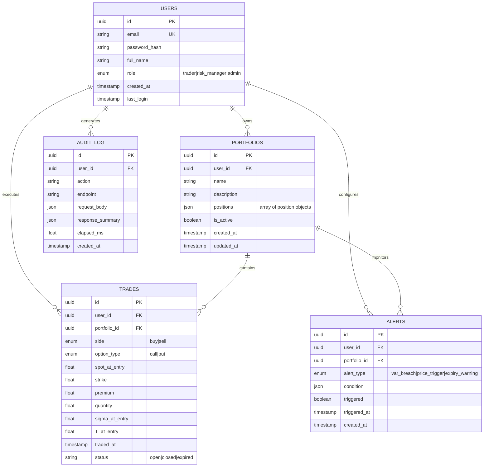
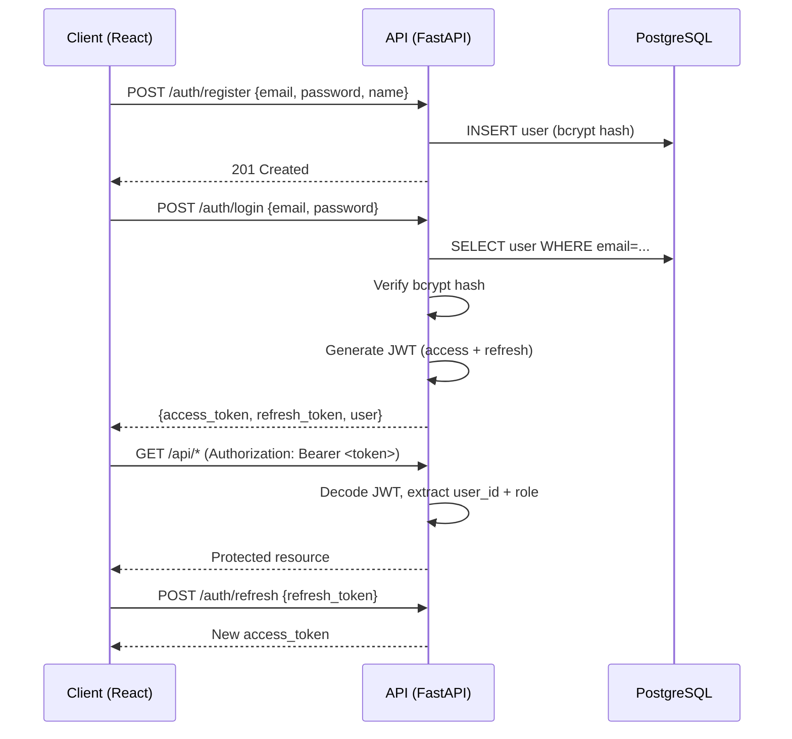
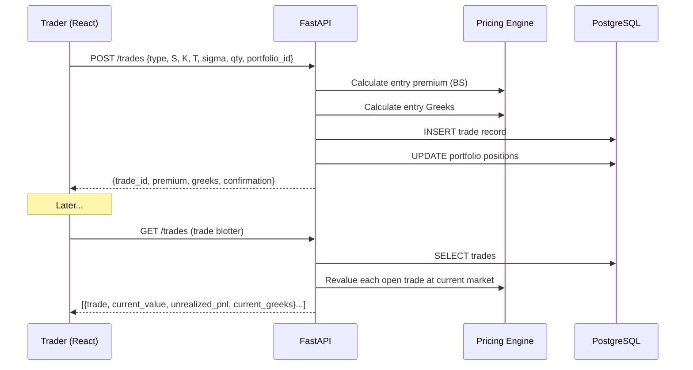
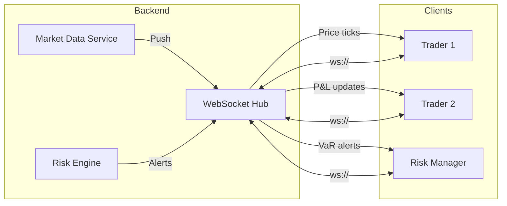
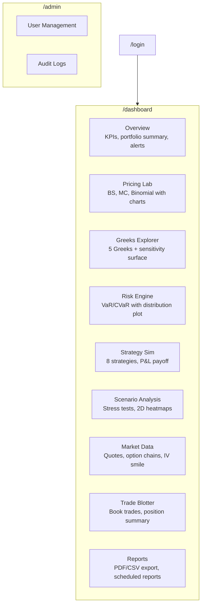
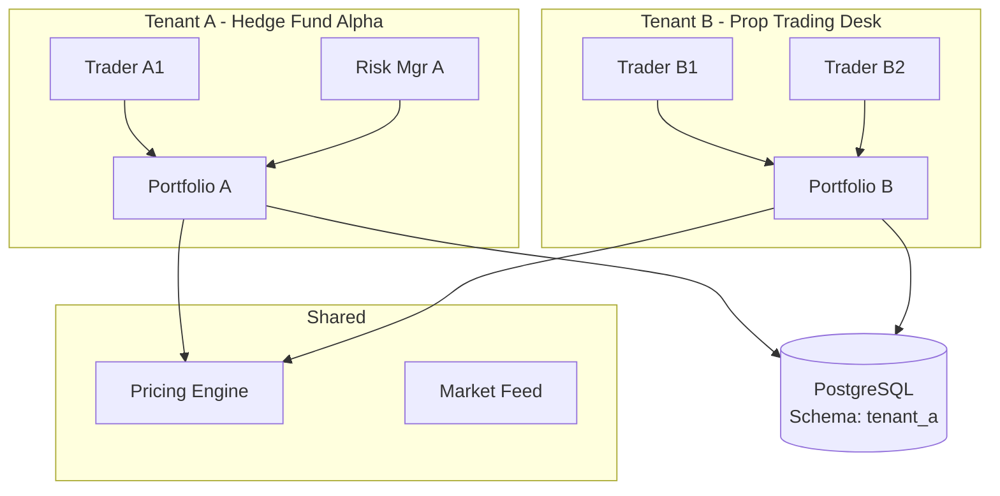
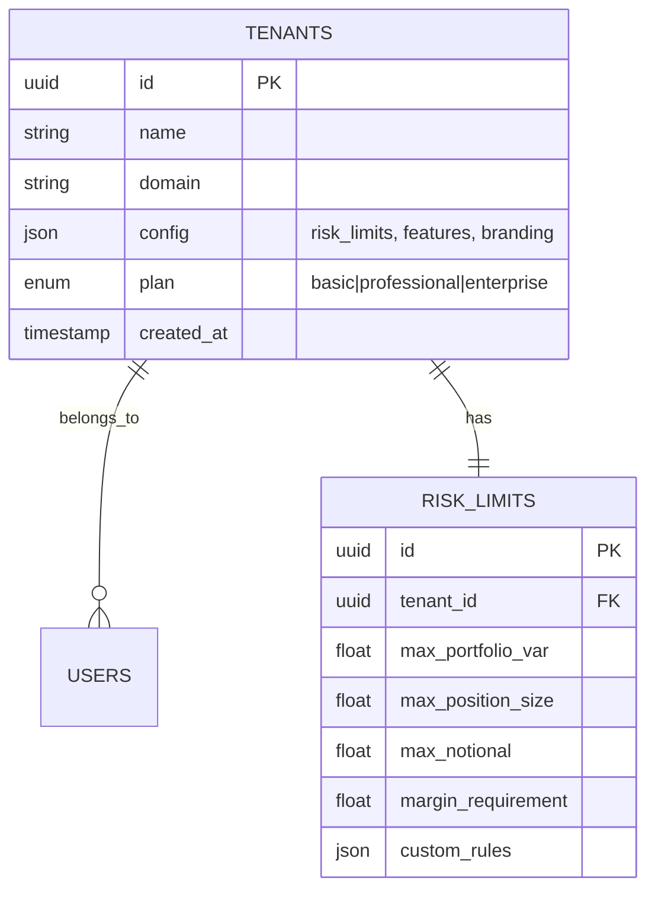
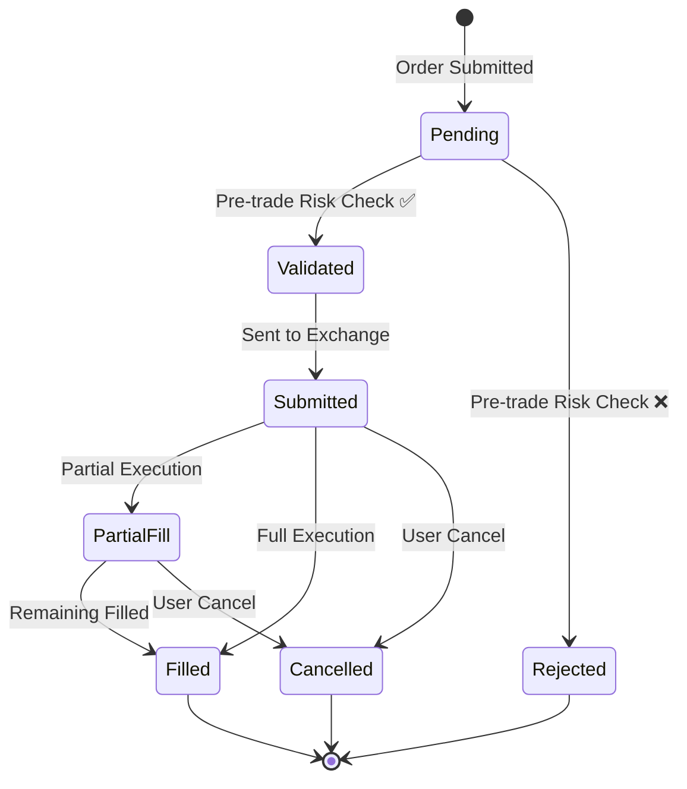
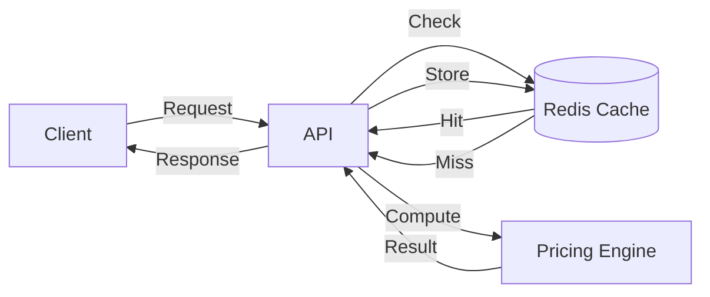
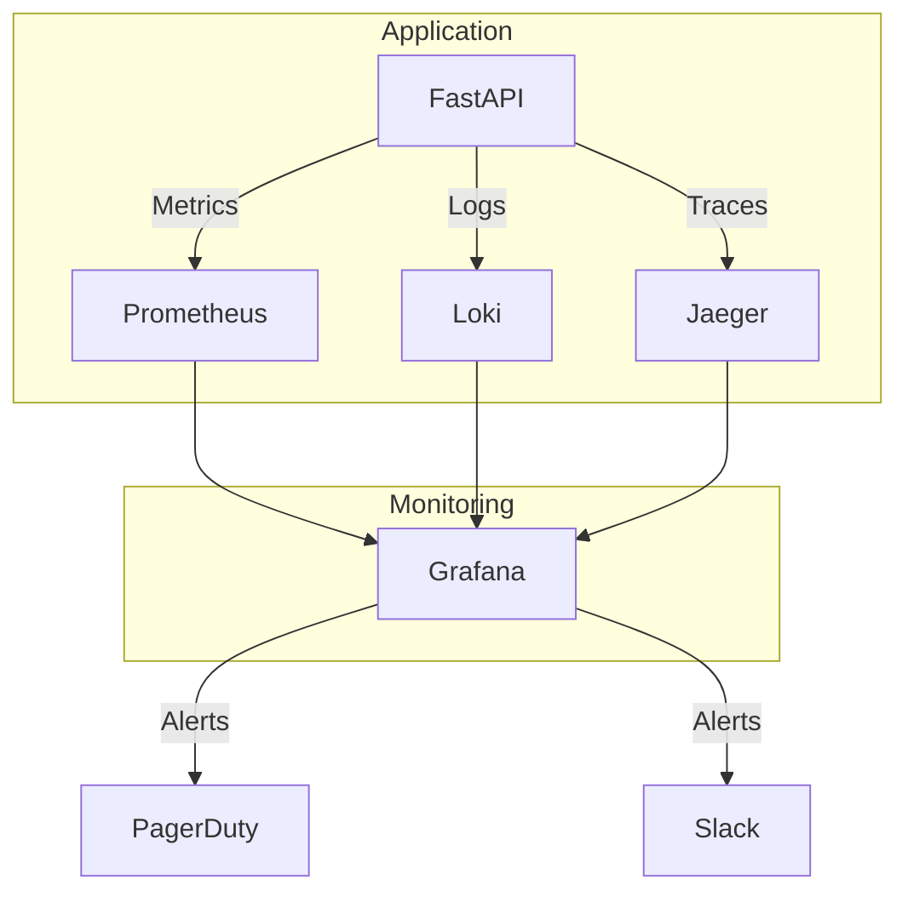

# Quant Engine → Institutional Fintech Platform

Transform the existing quant_engine from a pricing calculator into a **full-stack fintech platform** with authentication, real-time data, trade management, and a professional React dashboard.

## Current Foundation (What We Keep)

Everything in the existing `quant_engine/` backend is retained as the **computational core**:
- 3 pricing models (BS, MC, Binomial)
- 5 Greeks + portfolio Greeks
- IV solver, strategy simulator, scenario analysis
- VaR/CVaR risk engine
- 174 passing tests

The backend API stays as FastAPI — we rebuild the frontend and add infrastructure around it.

---

# TIER 2 — Full-Stack Fintech Application

> **Goal**: A complete, deployable fintech web app with auth, database, real-time feeds, and a professional React UI. The kind of project that wins interviews.

## Phase 1: Project Restructure & Database Layer

> [!IMPORTANT]
> This phase changes the project from "Python scripts with a static HTML page" to "a real full-stack application with a proper monorepo structure."

### 1.1 Monorepo Restructure

```
quant/
├── backend/                          # Python FastAPI (existing quant_engine, restructured)
│   ├── api/
│   │   ├── app.py                    # FastAPI app (API-only, no static files)
│   │   ├── routes/
│   │   ├── middleware/
│   │   │   ├── auth.py               # JWT auth middleware
│   │   │   └── rate_limit.py         # Rate limiting
│   │   └── websockets/
│   │       └── market_feed.py        # WebSocket endpoint for live data
│   ├── db/
│   │   ├── database.py               # SQLAlchemy engine + session
│   │   ├── models.py                 # ORM models (User, Portfolio, Trade, Alert)
│   │   └── migrations/               # Alembic migrations
│   ├── services/                     # Existing + new services
│   │   ├── auth_service.py           # Registration, login, JWT tokens
│   │   ├── portfolio_db_service.py   # CRUD for saved portfolios
│   │   ├── trade_service.py          # Trade booking & position tracking
│   │   ├── alert_service.py          # VaR breach & price alerts
│   │   ├── report_service.py         # PDF/CSV report generation
│   │   ├── pricing_service.py        # (existing)
│   │   ├── risk_service.py           # (existing)
│   │   ├── strategies.py             # (existing)
│   │   ├── scenario.py               # (existing)
│   │   └── market_data.py            # (existing, enhanced with WebSocket push)
│   ├── pricing/                      # (existing core — untouched)
│   ├── risk/                         # (existing core — untouched)
│   ├── models/                       # (existing GBM — untouched)
│   ├── schemas/                      # (existing + new Pydantic models)
│   ├── config/
│   │   └── settings.py               # Environment-aware config (dev/staging/prod)
│   ├── tests/                        # (existing + new)
│   ├── requirements.txt
│   └── Dockerfile
│
├── frontend/                         # Next.js React application
│   ├── src/
│   │   ├── app/                      # Next.js App Router pages
│   │   │   ├── layout.tsx            # Root layout with sidebar
│   │   │   ├── page.tsx              # Landing/login
│   │   │   ├── dashboard/
│   │   │   │   ├── page.tsx          # Overview dashboard
│   │   │   │   ├── pricing/page.tsx  # Pricing lab
│   │   │   │   ├── greeks/page.tsx   # Greeks explorer
│   │   │   │   ├── risk/page.tsx     # Risk engine
│   │   │   │   ├── strategy/page.tsx # Strategy simulator
│   │   │   │   ├── scenario/page.tsx # Scenario analysis
│   │   │   │   ├── market/page.tsx   # Market data & option chains
│   │   │   │   ├── trades/page.tsx   # Trade blotter & position book
│   │   │   │   └── reports/page.tsx  # Generated reports
│   │   │   └── admin/
│   │   │       └── page.tsx          # Admin panel (user management)
│   │   ├── components/
│   │   │   ├── ui/                   # Reusable UI components (shadcn/ui)
│   │   │   ├── charts/               # Plotly/Recharts wrappers
│   │   │   ├── forms/                # Pricing, risk, strategy input forms
│   │   │   ├── tables/               # Option chain, trade blotter tables
│   │   │   └── layout/               # Sidebar, header, footer
│   │   ├── lib/
│   │   │   ├── api.ts                # API client (fetch wrapper with auth)
│   │   │   ├── websocket.ts          # WebSocket client for live feeds
│   │   │   └── auth.ts               # Auth context & token management
│   │   ├── hooks/                    # Custom React hooks
│   │   └── types/                    # TypeScript types
│   ├── public/
│   ├── package.json
│   ├── tailwind.config.ts
│   ├── tsconfig.json
│   └── Dockerfile
│
├── docker-compose.yml                # Orchestrates backend + frontend + DB
├── .github/
│   └── workflows/
│       └── ci.yml                    # GitHub Actions CI/CD
└── README.md
```

### 1.2 Database Schema (PostgreSQL via SQLAlchemy)



### 1.3 Backend Dependencies (additions to requirements.txt)

```
# Database
sqlalchemy>=2.0
alembic>=1.13
asyncpg>=0.29          # Async PostgreSQL driver
psycopg2-binary>=2.9   # Sync fallback

# Auth
python-jose[cryptography]>=3.3  # JWT
passlib[bcrypt]>=1.7            # Password hashing

# Real-time
websockets>=12.0

# Reports
reportlab>=4.0          # PDF generation
openpyxl>=3.1           # Excel export

# Config
python-dotenv>=1.0
```

---

## Phase 2: Authentication & Authorization

### 2.1 Auth Flow



### 2.2 Role-Based Access

| Endpoint Group | Trader | Risk Manager | Admin |
|---------------|--------|-------------|-------|
| Pricing Lab | ✅ | ✅ | ✅ |
| Greeks / Strategy | ✅ | ✅ | ✅ |
| Trade Booking | ✅ | ❌ | ✅ |
| Risk Engine | ✅ (own) | ✅ (all) | ✅ (all) |
| Scenario Analysis | ✅ (own) | ✅ (all) | ✅ (all) |
| Reports | ✅ (own) | ✅ (all) | ✅ (all) |
| User Management | ❌ | ❌ | ✅ |
| Audit Logs | ❌ | ✅ (read) | ✅ |

### 2.3 New API Endpoints (Auth)

| Method | Endpoint | Description |
|--------|----------|-------------|
| `POST` | `/auth/register` | Create account |
| `POST` | `/auth/login` | Login → JWT tokens |
| `POST` | `/auth/refresh` | Refresh access token |
| `GET` | `/auth/me` | Current user profile |
| `PUT` | `/auth/me` | Update profile |

---

## Phase 3: Trade Capture & Portfolio Persistence

### 3.1 New API Endpoints (Trades & Portfolios)

| Method | Endpoint | Description |
|--------|----------|-------------|
| `GET` | `/portfolios` | List user's saved portfolios |
| `POST` | `/portfolios` | Create new portfolio |
| `GET` | `/portfolios/{id}` | Get portfolio with current valuations |
| `PUT` | `/portfolios/{id}` | Update portfolio |
| `DELETE` | `/portfolios/{id}` | Delete portfolio |
| `POST` | `/portfolios/{id}/calculate-risk` | Run VaR/CVaR on saved portfolio |
| `POST` | `/trades` | Book a trade |
| `GET` | `/trades` | Trade blotter (filterable) |
| `GET` | `/trades/{id}` | Trade detail with current P&L |
| `PUT` | `/trades/{id}/close` | Close a trade |
| `GET` | `/positions` | Current position summary (aggregated) |

### 3.2 Trade Booking Flow



---

## Phase 4: Real-Time WebSocket Feeds

### 4.1 WebSocket Architecture



### 4.2 WebSocket Channels

| Channel | Payload | Frequency |
|---------|---------|-----------|
| `market:{symbol}` | `{symbol, last_price, change, volume}` | Every 1s |
| `portfolio:{id}` | `{portfolio_value, unrealized_pnl, greeks}` | Every 5s |
| `alerts:{user_id}` | `{alert_type, message, severity}` | On trigger |

---

## Phase 5: Next.js React Frontend

### 5.1 Technology Choices

| Concern | Choice | Why |
|---------|--------|-----|
| Framework | Next.js 15 (App Router) | SSR, file-based routing, API routes for BFF |
| Styling | Tailwind CSS 4 | Utility-first, dark mode, fast iteration |
| Components | shadcn/ui | Professional, accessible, customizable |
| Charts | Recharts + Plotly.js | Recharts for standard charts, Plotly for 3D heatmaps |
| State | Zustand | Lightweight, no boilerplate |
| Forms | React Hook Form + Zod | Type-safe validation matching Pydantic schemas |
| Tables | TanStack Table | Sorting, filtering, pagination for blotters |
| Auth | NextAuth.js | JWT integration with our FastAPI backend |
| Real-time | Native WebSocket | Direct connection to FastAPI WS endpoint |

### 5.2 Page Map



### 5.3 UI Design System

| Token | Value | Usage |
|-------|-------|-------|
| `--bg-primary` | `#0a0b0d` | Main background |
| `--bg-card` | `#12141a` | Cards, panels |
| `--bg-elevated` | `#1a1c24` | Hover states, modals |
| `--accent-blue` | `#2962ff` | Primary actions, links |
| `--accent-green` | `#00cc66` | Profit, positive values |
| `--accent-red` | `#ff3b30` | Loss, negative values, alerts |
| `--accent-amber` | `#ffab00` | Warnings |
| `--text-primary` | `#e8eaed` | Primary text |
| `--text-secondary` | `#8b9298` | Labels, muted |
| `--font` | `Inter` | All text |
| `--font-mono` | `JetBrains Mono` | Numbers, code |
| `--radius` | `8px` | Border radius |

---

## Phase 6: Reporting & Alerts

### 6.1 Report Types

| Report | Format | Content |
|--------|--------|---------|
| Portfolio Risk Report | PDF | VaR/CVaR, Greeks, P&L distribution, scenario heatmap |
| Trade Confirmation | PDF | Trade details, entry price, Greeks at entry |
| Position Summary | CSV/Excel | All open positions with current valuations |
| EOD Risk Summary | PDF | End-of-day portfolio snapshot with metrics |

### 6.2 Alert Rules

| Alert Type | Trigger | Action |
|------------|---------|--------|
| VaR Breach | Portfolio VaR > user-defined threshold | WebSocket notification + email |
| Price Trigger | Spot crosses user-defined level | WebSocket notification |
| Expiry Warning | Position T < 3 days | Daily notification |
| Margin Call | Portfolio value drops below maintenance | Urgent WebSocket alert |

---

## Phase 7: CI/CD & Deployment

### 7.1 Docker Compose

```yaml
services:
  backend:
    build: ./backend
    ports: ["8000:8000"]
    environment:
      DATABASE_URL: postgresql+asyncpg://user:pass@db:5432/quant
      JWT_SECRET: ${JWT_SECRET}
    depends_on: [db]
    
  frontend:
    build: ./frontend
    ports: ["3000:3000"]
    environment:
      NEXT_PUBLIC_API_URL: http://backend:8000
      
  db:
    image: postgres:16-alpine
    volumes: [pgdata:/var/lib/postgresql/data]
    environment:
      POSTGRES_DB: quant
      POSTGRES_USER: user
      POSTGRES_PASSWORD: pass
      
volumes:
  pgdata:
```

### 7.2 GitHub Actions CI

```
on push → main:
  1. Lint (ruff + eslint)
  2. Backend tests (pytest)
  3. Frontend tests (vitest)
  4. Build Docker images
  5. Deploy to Render/Railway
```

---

# TIER 3 — Institutional Platform (on top of Tier 2)

> **Goal**: Production-grade infrastructure for a multi-user financial institution. Everything in Tier 2, plus the following enterprise-grade additions.

## Phase 8: Multi-Tenant Architecture

### 8.1 Tenant Isolation



- Row-level security in PostgreSQL (every table gets `tenant_id`)
- Tenant context extracted from JWT on every request
- Admin super-tenant can view across all tenants

### 8.2 Database Additions



---

## Phase 9: Order Management System (OMS)

### 9.1 Order Lifecycle



### 9.2 Pre-Trade Risk Checks

| Check | Rule | Action on Fail |
|-------|------|----------------|
| Position Limit | `new_position + existing < max_position_size` | Reject order |
| Notional Limit | `order_value < max_notional` | Reject order |
| VaR Impact | `portfolio_VaR_after < max_VaR` | Warn / Reject |
| Margin | `available_margin > required_margin` | Reject order |
| Fat Finger | `order_price within ±5% of market` | Require confirmation |

### 9.3 New API Endpoints (OMS)

| Method | Endpoint | Description |
|--------|----------|-------------|
| `POST` | `/orders` | Submit new order |
| `GET` | `/orders` | Order blotter (filterable) |
| `GET` | `/orders/{id}` | Order detail with fills |
| `DELETE` | `/orders/{id}` | Cancel pending order |
| `GET` | `/orders/{id}/risk-check` | Pre-trade risk assessment |
| `GET` | `/executions` | Fill history |

---

## Phase 10: Regulatory Reporting (Basel III/IV)

### 10.1 Risk Metrics

| Metric | Description | Calculation |
|--------|-------------|-------------|
| **Regulatory VaR** | 10-day 99% VaR | Scale 1-day VaR × √10 |
| **Stressed VaR** | VaR under crisis scenario | Using 2008/2020 historical windows |
| **Expected Shortfall** | Average loss beyond VaR | Already implemented (CVaR) |
| **Capital Charge** | Regulatory capital requirement | max(VaR, 3 × avg_VaR_60d) + sVaR |
| **Leverage Ratio** | Exposure / Capital | Computed from positions |
| **Concentration Risk** | Single-name exposure limits | Position-level analysis |

### 10.2 Regulatory Reports

| Report | Frequency | Format |
|--------|-----------|--------|
| Daily Risk Report | EOD | PDF with VaR, ES, Greeks, concentration |
| Regulatory Capital | Monthly | Excel (Basel template) |
| Large Exposure | On breach | PDF alert + regulator notification |
| Stress Test Results | Quarterly | PDF with scenario matrix |

---

## Phase 11: Performance Infrastructure

### 11.1 Caching Layer (Redis)



| Cached Data | TTL | Key Pattern |
|-------------|-----|-------------|
| BS Price | 5s | `bs:{S}:{K}:{T}:{r}:{σ}:{type}` |
| Option Chain | 10s | `chain:{symbol}:{expiry}` |
| Quote | 1s | `quote:{symbol}` |
| Portfolio Greeks | 30s | `greeks:portfolio:{id}` |
| Scenario Heatmap | 60s | `heatmap:{hash(positions)}:{axes}` |

### 11.2 Async Task Queue (Celery + Redis)

| Task | Queue | Priority |
|------|-------|----------|
| Monte Carlo pricing (large N) | `compute` | Normal |
| Portfolio risk calculation | `compute` | High |
| Scenario stress test (full grid) | `compute` | Normal |
| PDF report generation | `reports` | Low |
| EOD batch risk calculation | `batch` | High |
| Email notifications | `notifications` | Normal |

### 11.3 Backend Additions

```
# Performance (requirements.txt additions)
redis>=5.0
celery>=5.3
flower>=2.0          # Celery monitoring UI

# Monitoring
prometheus-fastapi-instrumentator>=6.0
```

---

## Phase 12: Monitoring & Observability

### 12.1 Stack



### 12.2 Key Metrics

| Metric | Alert Threshold |
|--------|----------------|
| API latency p99 | > 500ms |
| Pricing engine latency | > 100ms |
| Error rate | > 1% |
| WebSocket connections | > 90% capacity |
| DB connection pool | > 80% used |
| Redis hit rate | < 70% |
| Celery queue depth | > 100 tasks |

---

## Complete Endpoint Summary (Tier 2 + 3)

| Group | Tier 2 Endpoints | Tier 3 Additions |
|-------|-----------------|------------------|
| **Auth** | 5 (register, login, refresh, me, update) | +2 (tenant switch, API keys) |
| **Pricing** | 3 (BS, MC, Binomial) | — |
| **Greeks** | 2 (calculate, portfolio) | — |
| **Risk** | 1 (portfolio) | +3 (regulatory VaR, capital charge, concentration) |
| **Strategies** | 2 (list, simulate) | — |
| **Scenarios** | 2 (stress-test, heatmap) | +1 (regulatory stress) |
| **Market** | 3 (status, quote, chain) | — |
| **Portfolios** | 5 (CRUD + risk calc) | — |
| **Trades** | 4 (book, list, detail, close) | — |
| **Positions** | 1 (summary) | — |
| **Reports** | 3 (generate, list, download) | +2 (regulatory, scheduled) |
| **Alerts** | 3 (create, list, delete) | — |
| **Orders** | — | 5 (submit, list, detail, cancel, risk-check) |
| **Admin** | 2 (users, audit log) | +3 (tenants, limits, monitoring) |
| **WebSocket** | 3 channels | +2 (order status, system health) |
| **Total** | ~39 | ~49 |

---

## Execution Timeline

### Tier 2 (5-7 days)
| Day | Phase | Deliverables |
|-----|-------|-------------|
| 1 | Phase 1 | Monorepo restructure, PostgreSQL + SQLAlchemy models, Alembic |
| 2 | Phase 2 | JWT auth (register/login/refresh), middleware, role guards |
| 3 | Phase 3 | Portfolio CRUD, trade booking, position tracking |
| 4 | Phase 4 | WebSocket market feed, live P&L push |
| 5 | Phase 5a | Next.js setup, auth pages, dashboard layout, pricing/greeks pages |
| 6 | Phase 5b | Risk, strategy, scenario, market, trades pages |
| 7 | Phase 6-7 | Reports, alerts, Docker, CI/CD, deployment |

### Tier 3 (additional 7-10 days)
| Day | Phase | Deliverables |
|-----|-------|-------------|
| 8-9 | Phase 8 | Multi-tenant schema, tenant middleware, admin panel |
| 10-11 | Phase 9 | OMS (order lifecycle, pre-trade risk checks) |
| 12-13 | Phase 10 | Regulatory reporting (Basel metrics, PDF templates) |
| 14-15 | Phase 11 | Redis caching, Celery task queue, async pricing |
| 16-17 | Phase 12 | Prometheus + Grafana monitoring, alerting |

---

## Open Questions

> [!IMPORTANT]
> **Before I begin building, please confirm:**
> 1. **Start with Tier 2 only?** Or do you want both tiers built together?
> 2. **Frontend framework**: I've proposed Next.js + Tailwind + shadcn/ui. Are you comfortable with React/TypeScript, or would you prefer to stick with vanilla HTML/JS?
> 3. **Database**: PostgreSQL (recommended) or would you prefer SQLite for simplicity?
> 4. **Deployment target**: Render / Railway / Vercel, or just Docker local?
> 5. **Zerodha Kite**: Do you have actual Kite API credentials, or should we keep the mock provider as the primary data source?
